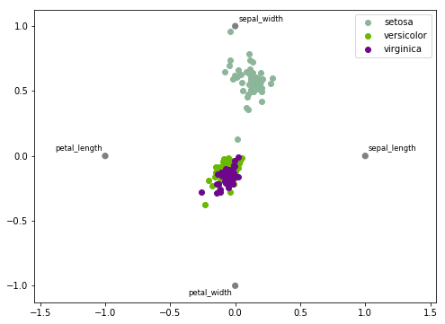

Title: Visual Exploratory Data Analysis
Slug: pandas/visual-exploratory-data-analysis
Category: Pandas
Tags: describe, scatter_matrix, show, figure, radviz
Date: 2017-09-25
Modified: 2019-02-20

### Import libraries


```python
import matplotlib.pyplot as plt
import seaborn as sns
from pandas.plotting import radviz, scatter_matrix

# Mac users who get an error: go to Python in your applications folder and click Install Certificates
iris_df = sns.load_dataset("iris")
```

### Inspect data
It's always a good idea to start with basic EDA before visualizing your data, just to get a feel for it.


```python
iris_df.head()
```


<div>
<style scoped>
    .dataframe tbody tr th:only-of-type {
        vertical-align: middle;
    }

    .dataframe tbody tr th {
        vertical-align: top;
    }

    .dataframe thead th {
        text-align: right;
    }
</style>
<table border="1" class="dataframe">
  <thead>
    <tr style="text-align: right;">
      <th></th>
      <th>sepal_length</th>
      <th>sepal_width</th>
      <th>petal_length</th>
      <th>petal_width</th>
      <th>species</th>
    </tr>
  </thead>
  <tbody>
    <tr>
      <th>0</th>
      <td>5.1</td>
      <td>3.5</td>
      <td>1.4</td>
      <td>0.2</td>
      <td>setosa</td>
    </tr>
    <tr>
      <th>1</th>
      <td>4.9</td>
      <td>3.0</td>
      <td>1.4</td>
      <td>0.2</td>
      <td>setosa</td>
    </tr>
    <tr>
      <th>2</th>
      <td>4.7</td>
      <td>3.2</td>
      <td>1.3</td>
      <td>0.2</td>
      <td>setosa</td>
    </tr>
    <tr>
      <th>3</th>
      <td>4.6</td>
      <td>3.1</td>
      <td>1.5</td>
      <td>0.2</td>
      <td>setosa</td>
    </tr>
    <tr>
      <th>4</th>
      <td>5.0</td>
      <td>3.6</td>
      <td>1.4</td>
      <td>0.2</td>
      <td>setosa</td>
    </tr>
  </tbody>
</table>
</div>


```python
iris_df.describe()
```


<div>
<style scoped>
    .dataframe tbody tr th:only-of-type {
        vertical-align: middle;
    }

    .dataframe tbody tr th {
        vertical-align: top;
    }

    .dataframe thead th {
        text-align: right;
    }
</style>
<table border="1" class="dataframe">
  <thead>
    <tr style="text-align: right;">
      <th></th>
      <th>sepal_length</th>
      <th>sepal_width</th>
      <th>petal_length</th>
      <th>petal_width</th>
    </tr>
  </thead>
  <tbody>
    <tr>
      <th>count</th>
      <td>150.000000</td>
      <td>150.000000</td>
      <td>150.000000</td>
      <td>150.000000</td>
    </tr>
    <tr>
      <th>mean</th>
      <td>5.843333</td>
      <td>3.057333</td>
      <td>3.758000</td>
      <td>1.199333</td>
    </tr>
    <tr>
      <th>std</th>
      <td>0.828066</td>
      <td>0.435866</td>
      <td>1.765298</td>
      <td>0.762238</td>
    </tr>
    <tr>
      <th>min</th>
      <td>4.300000</td>
      <td>2.000000</td>
      <td>1.000000</td>
      <td>0.100000</td>
    </tr>
    <tr>
      <th>25%</th>
      <td>5.100000</td>
      <td>2.800000</td>
      <td>1.600000</td>
      <td>0.300000</td>
    </tr>
    <tr>
      <th>50%</th>
      <td>5.800000</td>
      <td>3.000000</td>
      <td>4.350000</td>
      <td>1.300000</td>
    </tr>
    <tr>
      <th>75%</th>
      <td>6.400000</td>
      <td>3.300000</td>
      <td>5.100000</td>
      <td>1.800000</td>
    </tr>
    <tr>
      <th>max</th>
      <td>7.900000</td>
      <td>4.400000</td>
      <td>6.900000</td>
      <td>2.500000</td>
    </tr>
  </tbody>
</table>
</div>


### Scatter matrix
This gives a good overview of the relationships between the variables in your data.

`scatter_matrix` plots the correlation of all variables against one another, with histograms of all variables running diagonally. Look closely and you'll notice that the plot on either side of the diagonal are exactly the same, but transposed.


```python
scatter_matrix(iris_df, figsize=(10, 10))
plt.show()
```


### RadViz
This is a pretty cool way of visualizing the relative size of our measurements. First, a point is added for each variable: in our case, `sepal_length'`, `sepal_width`, `petal_length`, and `petal_width`. 

Now imagine that each observation is attached to these points with a spring and the greater the value is, the tighter the spring. Each observation is plotted where the springs 'settle'.

We can see that the sepal width of setosas is bigger than petal width, although petal length and sepal length are fairly balanced. Versicolors and virginicas are relatively even apart from a slight skew towards larger petal widths.


```python
fig = plt.figure(figsize=(8, 6))
ax = radviz(iris_df, 'species')
plt.show()
```





Take a look at the summary statistics for setosas to see how we get the plot above.


```python
iris_df[iris_df['species'] == 'setosa'].describe()
```


<div>
<style scoped>
    .dataframe tbody tr th:only-of-type {
        vertical-align: middle;
    }

    .dataframe tbody tr th {
        vertical-align: top;
    }

    .dataframe thead th {
        text-align: right;
    }
</style>
<table border="1" class="dataframe">
  <thead>
    <tr style="text-align: right;">
      <th></th>
      <th>sepal_length</th>
      <th>sepal_width</th>
      <th>petal_length</th>
      <th>petal_width</th>
    </tr>
  </thead>
  <tbody>
    <tr>
      <th>count</th>
      <td>50.00000</td>
      <td>50.000000</td>
      <td>50.000000</td>
      <td>50.000000</td>
    </tr>
    <tr>
      <th>mean</th>
      <td>5.00600</td>
      <td>3.428000</td>
      <td>1.462000</td>
      <td>0.246000</td>
    </tr>
    <tr>
      <th>std</th>
      <td>0.35249</td>
      <td>0.379064</td>
      <td>0.173664</td>
      <td>0.105386</td>
    </tr>
    <tr>
      <th>min</th>
      <td>4.30000</td>
      <td>2.300000</td>
      <td>1.000000</td>
      <td>0.100000</td>
    </tr>
    <tr>
      <th>25%</th>
      <td>4.80000</td>
      <td>3.200000</td>
      <td>1.400000</td>
      <td>0.200000</td>
    </tr>
    <tr>
      <th>50%</th>
      <td>5.00000</td>
      <td>3.400000</td>
      <td>1.500000</td>
      <td>0.200000</td>
    </tr>
    <tr>
      <th>75%</th>
      <td>5.20000</td>
      <td>3.675000</td>
      <td>1.575000</td>
      <td>0.300000</td>
    </tr>
    <tr>
      <th>max</th>
      <td>5.80000</td>
      <td>4.400000</td>
      <td>1.900000</td>
      <td>0.600000</td>
    </tr>
  </tbody>
</table>
</div>


These are just two examples to start off with. For more plots than you'll ever need in your life, see the [Pandas visualization guide](https://pandas.pydata.org/pandas-docs/stable/visualization.html).
