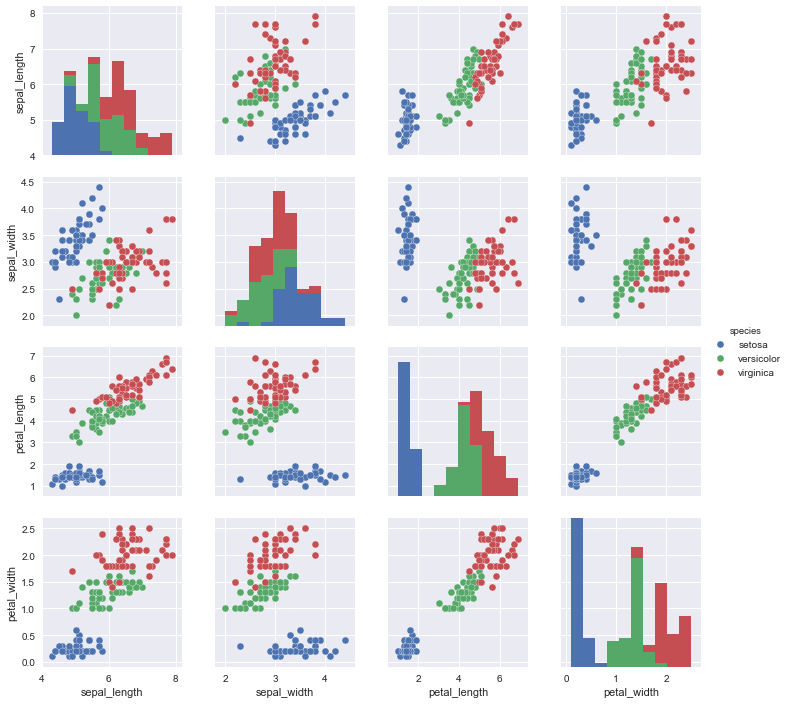

Title: Pairplots
Slug: seaborn/pairplots
Category: Seaborn
Tags: load_dataset, head, pairplot, show
Date: 2017-09-25
Modified: 2017-09-25

#### Import libraries


```python
# Although not strictly required, importing pyplot allows for
# greater customization as Seaborn is built upon it
import matplotlib.pyplot as plt
import seaborn as sns
```

#### Load and inspect data


```python
df = sns.load_dataset('iris')
df.head()
```


<div>
<table border="1" class="dataframe">
  <thead>
    <tr style="text-align: right;">
      <th></th>
      <th>sepal_length</th>
      <th>sepal_width</th>
      <th>petal_length</th>
      <th>petal_width</th>
      <th>species</th>
    </tr>
  </thead>
  <tbody>
    <tr>
      <th>0</th>
      <td>5.1</td>
      <td>3.5</td>
      <td>1.4</td>
      <td>0.2</td>
      <td>setosa</td>
    </tr>
    <tr>
      <th>1</th>
      <td>4.9</td>
      <td>3.0</td>
      <td>1.4</td>
      <td>0.2</td>
      <td>setosa</td>
    </tr>
    <tr>
      <th>2</th>
      <td>4.7</td>
      <td>3.2</td>
      <td>1.3</td>
      <td>0.2</td>
      <td>setosa</td>
    </tr>
    <tr>
      <th>3</th>
      <td>4.6</td>
      <td>3.1</td>
      <td>1.5</td>
      <td>0.2</td>
      <td>setosa</td>
    </tr>
    <tr>
      <th>4</th>
      <td>5.0</td>
      <td>3.6</td>
      <td>1.4</td>
      <td>0.2</td>
      <td>setosa</td>
    </tr>
  </tbody>
</table>
</div>


#### Basic pairplot
This gives a good overview of the relationships between the variables in your data.

`pairplot` is similar to `scatter_matrix` in Pandas except, like most Seaborn plots, it looks snazzier.


```python
sns.pairplot(df)
plt.show()
```


#### Adding some variation
There's a decent chance you've seen the Iris dataset before. If you have, you'll know the three species are setosa, versicolor, and virginica. Let's add some colour to distinguish them.


```python
sns.pairplot(df, hue='species')
plt.show()
```





There are lots of tweaks you can make to your pairplots. The Seaborn API is really clean and [so are the docs](https://seaborn.pydata.org/generated/seaborn.pairplot.html), so dive in and have a muck around.
